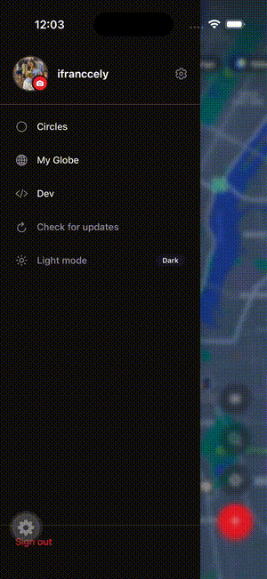
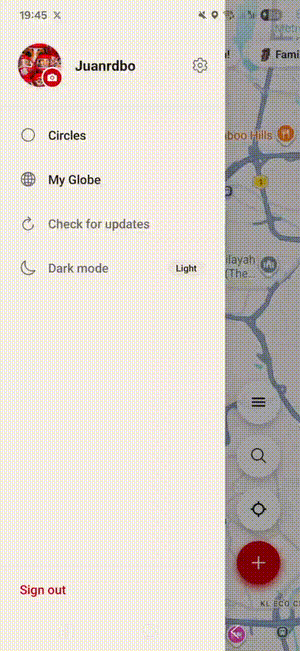

# expo-circular-reveal

[](https://github.com/JuanRdBO/expo-circular-reveal/actions/workflows/validate.yml)
[](https://www.npmjs.com/package/expo-circular-reveal)
[](https://www.npmjs.com/package/expo-circular-reveal)

Telegram-style circular reveal theme transitions for React Native. Built as an Expo Module with native iOS (Swift) and Android (Kotlin) implementations.

<table align="center">
  <tr>
    <th>iOS</th>
    <th>Android</th>
  </tr>
  <tr>
    <td></td>
    <td></td>
  </tr>
</table>

## How it works

1. Captures a screenshot of the current screen
2. Overlays the screenshot on top of the app
3. Your code swaps the theme underneath
4. Animates a circular hole expanding from the tap point, revealing the new theme

## Installation

```bash
npx expo install expo-circular-reveal
```

Then rebuild your dev client:

```bash
npx expo prebuild --clean
npx expo run:ios   # or run:android
```

> Requires a [dev client](https://docs.expo.dev/develop/development-builds/introduction/) — will not work in Expo Go. This package includes native code (Swift + Kotlin) that must be compiled into your app binary.

## Usage

```tsx
import { triggerTransition } from 'expo-circular-reveal';
import { Pressable, Text } from 'react-native';

function ThemeToggle() {
  const handlePress = async (e) => {
    const { pageX, pageY } = e.nativeEvent;

    // 1. Capture screen + show overlay
    await triggerTransition(pageX, pageY, 800);

    // 2. Swap your theme here (the overlay hides the flash)
    // e.g. Appearance.setColorScheme('dark')
    // or your state management theme toggle

    // 3. The circular reveal animation runs automatically
  };

  return (
    <Pressable onPress={handlePress}>
      <Text>Toggle Theme</Text>
    </Pressable>
  );
}
```

## API

### `triggerTransition(centerX, centerY, durationMs)`

| Parameter | Type | Description |
|-----------|------|-------------|
| `centerX` | `number` | X coordinate of the reveal origin (logical points) |
| `centerY` | `number` | Y coordinate of the reveal origin (logical points) |
| `durationMs` | `number` | Animation duration in milliseconds |

**Returns:** `Promise<string>` — resolves with `"ready"` when the overlay is visible and it's safe to swap the theme.

## Platform Details

### iOS
- Screen capture via `UIGraphicsImageRenderer.drawHierarchy`
- Circular mask via `CAShapeLayer` with even-odd fill rule
- `CABasicAnimation` for smooth path interpolation

### Android
- Screen capture via `PixelCopy` (Android 8.0+) with `drawingCache` fallback
- Custom `View` with `Canvas.clipPath` using even-odd `Path.FillType`
- `ValueAnimator` with `DecelerateInterpolator`

## Requirements

- Expo SDK 52+
- iOS 15+
- Android API 24+ (minSdk)

## License

MIT
